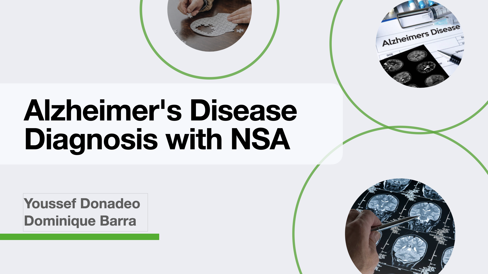

<h1 align="center">
    Versions Unveiled: The Evolution of NSA 🚀
    <br />
    <br />
    
</h1>


## Table of Contents

1. [Introduction](#introduction)
2. [Motivation](#motivation)
3. [Quick start](#quick-start)
4. [Author](#author)
5. [License](#license)
---
## Introduction

Alzheimer's disease, the most common neurodegenerative disorder, affects over 40 million people globally, with projections estimating a rise to 131.5 million by 2050 due to aging populations. Addressing this challenge requires multifaceted approaches, including research, early detection, and support systems, to mitigate its impact on individuals and society. Raising awareness and reducing stigma are crucial alongside medical advancements to improve the lives of those affected and their caregivers.

In this project we use NSA variants to improve the anomaly detection.

See full report [here](doc/Alzheimer’s Disease Diagnosis with Negative Selection Algorithm Report.pdf).

---
## Motivation


NSA is widely used in the field of anomaly detection but does, in fact, have some major drawbacks and
a lot of research has been done over the years to minimize or eliminate them.

---
## Quick Start

Change the [configuration](config/config.yml).

```commandline
python main.py
```

---
## Author
<style>
  
  .row {
      display: flex; 
      gap: 3rem; 
      align-items: center;
   }
  
  .col {
      display: flex;
      flex-direction: column; 
      align-items: center;
    }
  .container {
      margin-bottom: -1rem;
    }
  .image {
      border-radius: 50%;
  }
  
</style>
<div>
  <div class="row">
    <div class="col">
        <a href="https://github.com/yDon96" class="container">
            
        </a>
        <br />
        <sub>
            <a href="https://github.com/yDon96" style="text-align: center">
                yDon96
            </a>
        </sub>
    </div>
    <div style="display: flex; flex-direction: column; align-items: center;">
        <a href="https://github.com/NickSenzaName" style="margin-bottom: -1rem">
            
        </a>
        <br />
        <sub>
            <a href="https://github.com/NickSenzaName" style="text-align: center">
                NickSenzaName
            </a>
        </sub>
    </div>
</div>
</div>


---
## 📝 License

Copyright © 2022-2024 [Youssef Donadeo](https://github.com/yDon96) and [Dominique Barra](https://github.com/NickSenzaName) <br/>
This project is [GNUv3]() licensed.
